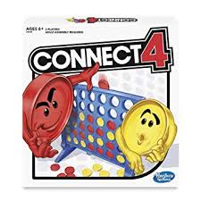

# Game: Connect 4
## Author: Allen Huang (301280711)
---
### **Description**:



> Connect Four (also known as Captain's Mistress, Four Up, Plot Four, Find Four, Four in a Row, Four in a Line, Drop Four, and Gravitrips (in Soviet Union)) is a two-player connection game in which the players first choose a color and then take turns dropping one colored disc from the top into a seven-column, six-row vertically suspended grid. The pieces fall straight down, occupying the lowest available space within the column. The objective of the game is to be the first to form a horizontal, vertical, or diagonal line of four of one's own discs. Connect Four is a solved game. The first player can always win by playing the right moves.
The game was first sold under the Connect Four trademark[3] by Milton Bradley in February 1974.

### **Instructions**:
- How to compile the code:
```
    $ make
```
- This will generate a executable file: connect4
```
    $ ./connect4
```
  
### **Game Mode**:
```
1: VS. pMST AI, 2: VS. heuristic, 3: pMST vs. heuristic => 
```

Following the instruction from the terminal please.

*this program can handle wrong input, will repeat until the right input.*
